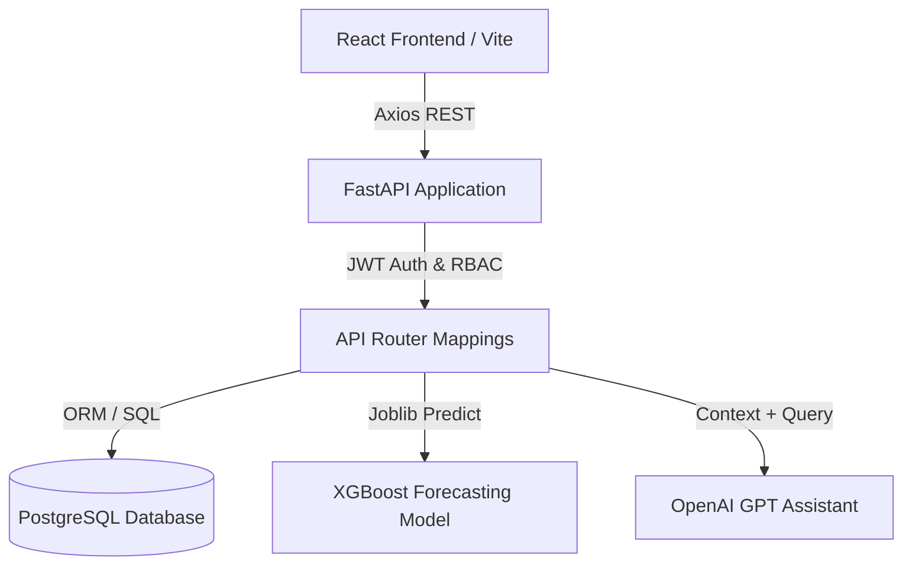
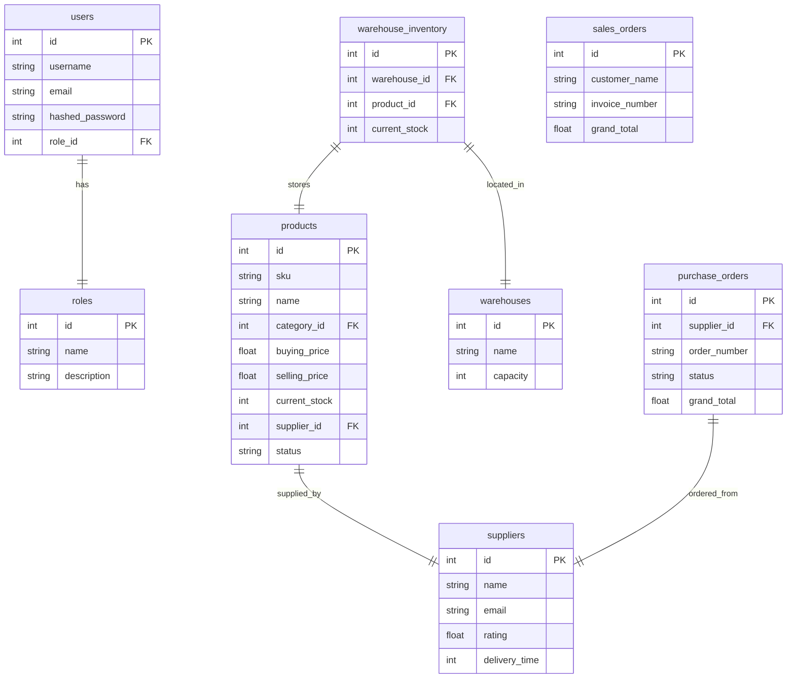

# RetailOS – AI-Powered Retail Supply Chain Platform

RetailOS is a modern, production-ready enterprise supply chain platform featuring a normalized database, secure JWT authorization, role-based access control, machine learning-driven demand forecasting, and an AI chat assistant.

---

## Architecture Diagram



---

## Database ER Diagram



---

## Folder Structure

```text
retail_os/
├── docker-compose.yml
├── README.md
├── backend/
│   ├── Dockerfile
│   ├── requirements.txt
│   └── app/
│       ├── main.py
│       ├── database/      # Session and Engine initialization
│       ├── models/        # SQLAlchemy Database models (18 tables)
│       ├── schemas/       # Pydantic schemas
│       ├── auth/          # JWT and Password Hashing helpers
│       ├── ml/            # XGBoost Forecast logic & synthetic dataset generator
│       ├── ai/            # OpenAI GPT prompt builder
│       └── utils/         # DB Seed script (100 products, 20 suppliers, etc.)
└── frontend/
    ├── Dockerfile
    ├── package.json
    └── src/
        ├── main.jsx
        ├── App.jsx
        ├── components/    # Reusable charts, Sidebar, Navbar
        ├── context/       # Auth and Theme (Light/Dark mode)
        ├── pages/         # Dashboard, Inventory, POs, AI chat
        └── services/      # Axios API mappings
```

---

## Installation & Setup

### Docker Deployment (Recommended)

1. Make sure you have Docker and Docker Compose installed.
2. In the project root, start all containers:
   ```bash
   docker compose up --build
   ```
3. Once running, access the services:
   - **Frontend React UI**: `http://localhost:5173`
   - **FastAPI Backend (Swagger API Docs)**: `http://localhost:8000/docs`

---

## Demo Credentials (Seeded Roles)

You can log in directly using one of the pre-configured credentials:

| Username | Password | Role | Description |
| :--- | :--- | :--- | :--- |
| **admin** | admin123 | Admin | Full dashboard control and access logs |
| **w_manager** | manager123 | Warehouse Manager | Stock allocation & logistics transfers |
| **p_manager** | procure123 | Procurement Manager | Suppliers and PO approvals |
| **staff** | staff123 | Warehouse Staff | Issue stock adjustments and view counts |
| **viewer** | viewer123 | Viewer | Read-only analytics dashboard |

---

## Key Features

1. **Secure Access**: Authenticated using stateless JWT tokens. Routes are guarded client-side and verified server-side with strict Role-Based Access Control (RBAC).
2. **Dashboard Analytics**: Visualize sales trends, monthly budgets, and warehouse utilization using custom theme-adaptive Recharts.
3. **ML Forecasting**: Train and load an XGBoost regression model using Joblib to predict item demand trends over weeks, months, or quarters.
4. **AI Assistant**: Conversational agent powered by OpenAI GPT, receiving real-time SQL summaries on safety thresholds, delivery ratings, and stock status to answer supply questions.
5. **CSV Operations**: Import/Export catalog products with CSV file uploads directly from the dashboard.
6. **Audit Trail**: Every update, deletion, login, and approval is logged in a secure, read-only audit log registry.
